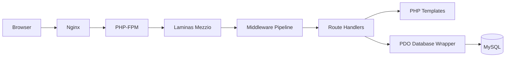

Order Management System
A PHP backend-focused web application for managing products, customers, orders, inventory, returns, promotions, and business analytics.

PHP Laminas Mezzio MySQL Docker

Overview
Order Management System is a server-rendered PHP application built with Laminas Mezzio. It centralizes common order operations for a small online business, including product inventory, customer records, order processing, return handling, promotion settings, and reporting.

The application uses PHP sessions for authentication, role-based access for administrator screens, MySQL for persistence, and PDO for database access. It is designed to run locally with Docker Compose using Nginx, PHP-FPM, MySQL, and phpMyAdmin.

Features
Administrator
View dashboard metrics and analytics.
Manage products and inventory stock.
Create and view customer records.
View, process, complete, and cancel orders.
Review return requests.
Approve or reject pending returns.
Import products from CSV.
Export products as CSV or XLSX.
Configure new-user promotion settings.
User
Register, log in, and log out.
Browse active products.
Place product orders.
View personal order history.
View order details.
Cancel eligible pending orders.
Submit return requests for eligible orders.
View return request history.
Update profile name.
Change account password.

```mermaid
flowchart LR
    Browse[Browse active products] --> Buy[Place order]
    Buy --> Validate[Validate product and stock]
    Validate --> Create[Create order and order item]
    Create --> Stock[Reduce product stock]
    Stock --> History[View order history]
    History --> Cancel[Cancel pending order]
    Cancel --> Restore[Restore stock]

```

Technology Stack
Area	Technology
Language	PHP 8.2+
Framework	Laminas Mezzio
Routing	Mezzio FastRoute
Dependency injection	Laminas ServiceManager
Database	MySQL 8.0
Data access	PDO / PDO MySQL
Web server	Nginx
Runtime	PHP-FPM
Local environment	Docker Compose
Views	Server-rendered PHP templates
Spreadsheet support	PhpSpreadsheet
Quality tools	PHPUnit, PHP_CodeSniffer, Psalm
Installation and Docker Setup
Prerequisites
Docker
Docker Compose
Composer is installed inside the PHP image during the Docker build. To run Composer commands directly on the host machine, install PHP 8.2+ and Composer locally.

Start the Application
Run this from the repository root:

docker compose up --build
The Docker setup starts four services:

Service	Container	Access
Application	order_nginx	http://localhost:8080
phpMyAdmin	order_phpmyadmin	http://localhost:8081
MySQL	order_mysql	host 3307, container 3306
PHP-FPM	order_php	internal port 9000
Stop the containers:

docker compose down
Database
The MySQL service initializes from:

docker/mysql/init.sql
On first startup, it creates the order_management database and tables for users, customers, products, orders, order items, returns, and promotion settings.

Local Docker database defaults:

Host from PHP container: mysql
Host port: 3307
Container port: 3306
Database: order_management
User: root
Password: empty
Database configuration is read from src/config/autoload/database.global.php. Supported environment variables include:

DB_HOST
DB_PORT
DB_NAME
DB_USER
DB_PASS
MYSQLHOST
MYSQLPORT
MYSQLDATABASE
MYSQLUSER
MYSQLPASSWORD
DATABASE_URL
MYSQL_URL
Project Structure
.
|-- docker/
|   |-- mysql/init.sql
|   |-- nginx/default.conf
|   |-- php-fpm/railway.conf
|   `-- start.sh
|-- src/
|   |-- bin/
|   |-- config/
|   |-- database/
|   |-- public/
|   |-- src/App/
|   |   |-- Database/
|   |   |-- Handler/
|   |   |-- Helper/
|   |   |-- Middleware/
|   |   `-- templates/
|   |-- test/
|   |-- composer.json
|   |-- phpcs.xml.dist
|   |-- phpunit.xml.dist
|   `-- psalm.xml.dist
|-- docker-compose.yml
|-- Dockerfile
`-- README.md
Quality and Testing Commands
Run Composer commands from the src directory.

Install dependencies when running outside Docker:

composer install
Start PHP's built-in development server:

composer serve
Run PHPUnit:

composer test
Run PHP_CodeSniffer:

composer cs-check
Run Psalm static analysis:

composer static-analysis
Run the combined check script:

composer check
The current automated tests cover skeleton handlers and the analytics handler factory. The main business workflows are implemented in route handlers, but test coverage for products, orders, returns, authentication, and promotions is limited.

Author
Emiliano Duma

